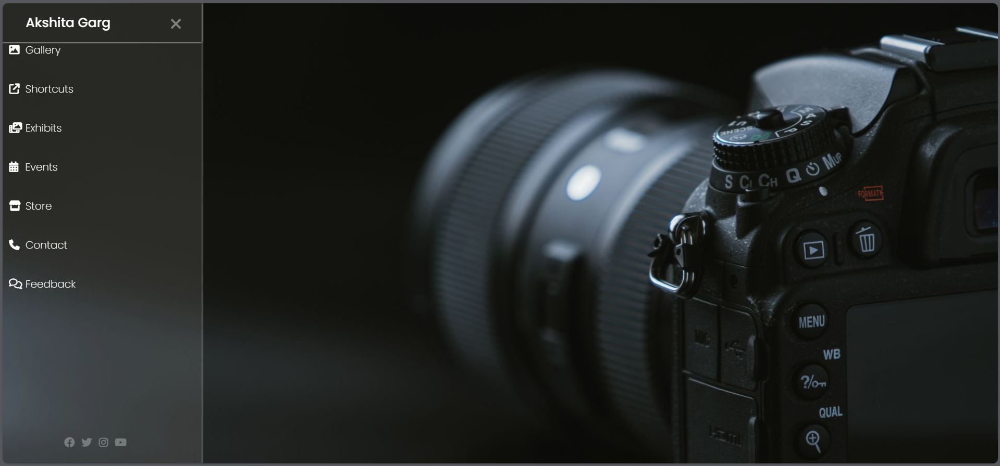

# PhotographyPage
A minimal and elegant photography-themed landing page built using only **HTML** and **CSS**.   This project was created as a learning exercise focused on layout design and hamburger menu interaction without any JavaScript.

--

## 🚀 Features

- 📱 Hamburger menu icon that opens a sliding sidebar
- 🎨 Clean visual layout suitable for a photography portfolio
- 🎯 Pure HTML & CSS based — no JavaScript used

---

## ⚠️ Limitations

- ❌ Not responsive (optimized for laptop/desktop screens)
- ❌ Static UI (no functional interactivity beyond CSS transitions)

---

## 🛠️ Tech Stack

- **HTML5**
- **CSS3**
  - Flexbox layout
  - CSS transitions
  - Positioning

---
## screenshot

## 💡 What I Learned

- Building a toggle sidebar using only CSS
- Structuring layouts for visual presentation
- Improving design consistency and spacing

---

## 📁 Folder Structure

|-photographypage/
|-.gitignore
|- image-1.png
|-image.png
|-index.html
|-README.md
|-style.css